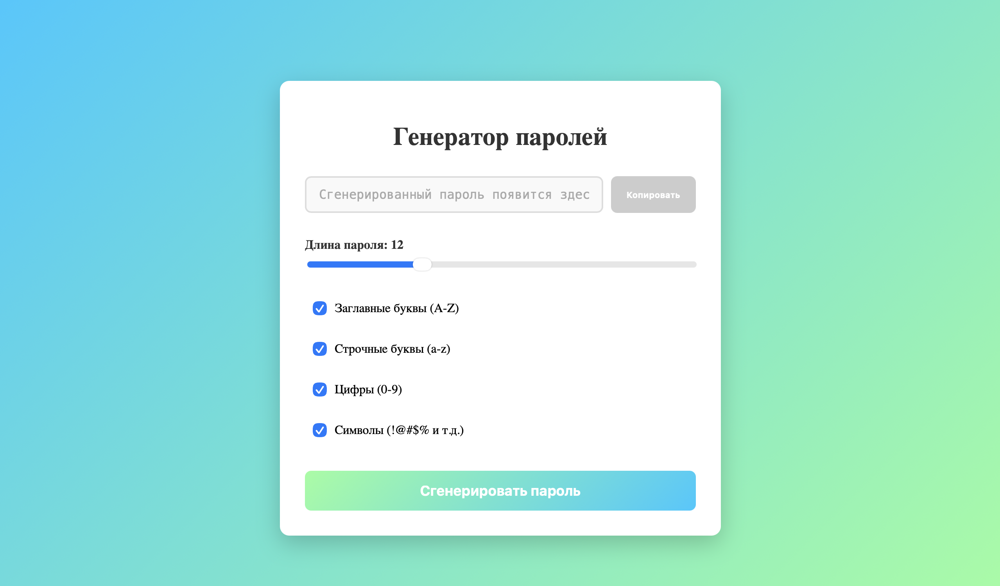
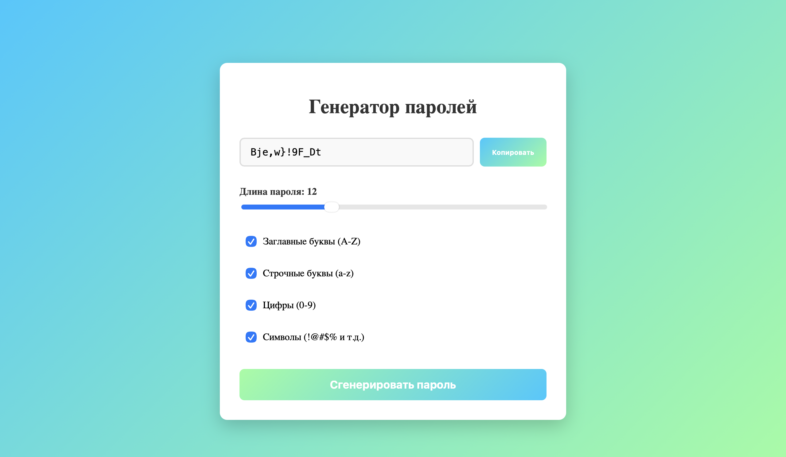
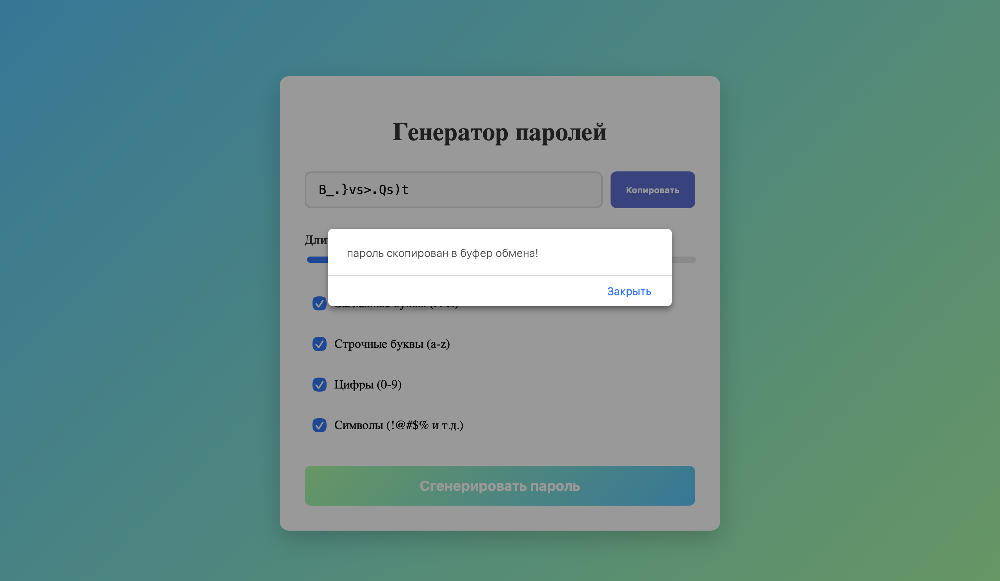

# Генератор паролей

Простой генератор случайных паролей с настройками.

## Функции
- Генерация случайных паролей
- Настройка длины пароля (4-32 символа)
- Выбор типов символов: заглавные, строчные, цифры, специальные
- Копирование пароля в буфер обмена
- Адаптивный дизайн

## Скриншоты работы

### Главная страница

### Работоспособность

#### Генерация пароля

#### Копирование пароля

#### Настройки символов

## Итог

В рамках контрольной работы был создан генератор паролей на React.
Данная работа помогла мне лучше понять работу с состоянием в React, обработку событий и создание интерактивных интерфейсов. Также укрепились знания по работе с хуками useState и манипуляциями с DOM.